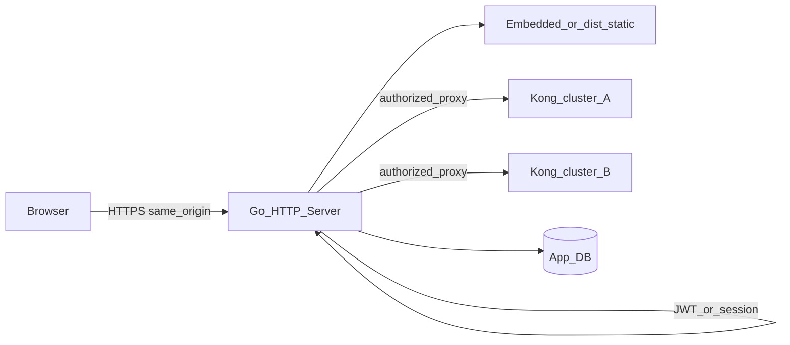

# Kế hoạch backend Kong Manager (BFF Go + Vue)

Tài liệu theo dõi roadmap: kiến trúc, phase triển khai, biến môi trường và checklist. Cập nhật khi phạm vi thay đổi.

## Trạng thái triển khai (tóm tắt)

| Hạng mục | Trạng thái |
|----------|------------|
| Go: HTTP, health, static SPA, proxy `/kong-admin`, JWT login, Casbin, GORM (postgres/mysql/sqlite) | Đã có khung (xem `cmd/`, `internal/`) |
| Vue: `/login`, guard `AUTH_REQUIRED`, Bearer token, `ADMIN_API_URL` path same-origin | Đã có khung (xem `src/`) |
| OIDC đa provider, notify đa kênh, Dockerfile/Helm chi tiết | Kế hoạch (phase sau) |
| **Nhiều cluster Kong** (đăng ký nhiều Admin API, chọn cluster trên UI, phân quyền theo cluster) | Kế hoạch — xem [Nhiều cluster Kong](#nhiều-cluster-kong-multi-cluster) |

---

## Checklist công việc (từ plan gốc)

- [ ] Skeleton Go: static + health + metrics + env `KONG_ADMIN_URL`, `DATABASE_*`
- [ ] GORM + migrations đầy đủ: `sso_providers`, `notification_channels`, …
- [ ] Auth: internal ổn định + OIDC (Keycloak/Azure/Google) cấu hình DB
- [ ] Casbin RBAC theo group + API quản trị policy (nếu cần)
- [ ] Reverse proxy Kong + map FE `ADMIN_API_URL` → same-origin (đang dùng `/kong-admin`)
- [ ] Notify: MS Teams, Slack, Telegram, email + CRUD cấu hình DB
- [ ] Multi-stage Dockerfile + tài liệu / values Helm (DB, secrets)
- [ ] **Multi-cluster**: bảng cluster + proxy động theo cluster đã chọn + UI chọn cluster + Casbin/ACL theo cluster (hoặc domain)

---

## Nhiều cluster Kong (multi-cluster)

Mục tiêu: **một Kong Manager** có thể quản lý **nhiều cụm** (prod/staging, nhiều region, nhiều tenant), không gắn cứng một `KONG_ADMIN_URL` / một mạng internal duy nhất.

### Mô hình dữ liệu (gợi ý)

- Bảng **`kong_clusters`** (tên gọi có thể đổi):
  - `id` (UUID hoặc ULID), `name` (hiển thị), **`slug`** (duy nhất, dùng trong URL hoặc API).
  - **`admin_base_url`**: URL Kong Admin của cụm đó (chỉ BFF gọi được — mạng nội bộ/VPN/service mesh).
  - **`admin_token`** / basic auth / cert: lưu **đã mã hoá** (cùng cơ chế `ENCRYPTION_KEY`); không trả về nguyên vẹn cho FE, chỉ cho phép “rotate” qua API.
  - `enabled`, `sort_order`, `labels`/`environment` (tuỳ chọn), `created_at` / `updated_at`.
- **Gợi ý bootstrap**: một cluster **mặc định** (từ env `KONG_ADMIN_URL` / `KONG_ADMIN_TOKEN` hiện tại) được seed vào DB lần đầu, để không phá vỡ triển khai single-cluster.

### Routing BFF (proxy)

Thay vì chỉ `/kong-admin/*` → một upstream cố định, cần **định danh cluster** trên mỗi request REST:

| Cách | Ưu / nhược |
|------|------------|
| **Path** `.../kong-admin/c/{clusterSlug}/...` | Dễ debug, dễ cache; FE đặt `ADMIN_API_URL` = base + `/kong-admin/c/{slug}` sau khi user chọn cluster. Phù hợp axios/Kong UI giữ nguyên pattern “một base URL”. |
| **Header** `X-Kong-Cluster: {slug}` | URL gọn; phải cấu hình axios interceptor (đã có) + đảm bảo mọi client (kể cả form libs) gửi header. |

**Khuyến nghị**: path **`/kong-admin/c/{slug}`** (hoặc `/kong-admin/clusters/{id}`) — strip cả prefix proxy lẫn segment cluster, rồi forward phần còn lại tới `admin_base_url` của cluster đó.

Ví dụ: request `GET /kong-admin/c/prod-eu/services` → upstream `http://kong-prod-eu:8001/services`.

### Phân quyền (Casbin / RBAC)

- **Phạm vi theo cluster**: không cho user “admin global” tự động trên mọi cluster trừ khi policy cho phép.
- Hướng xử lý:
  - **Casbin domains** (`domain` = `cluster_id` hoặc `slug`), hoặc
  - **Obj** có dạng `/kong-admin/c/prod/*` để gán quyền theo prefix cluster.
- Gợi ý policy: nhóm `platform-admins` → `*` mọi cluster; nhóm `team-a` → chỉ `slug` `staging`, `dev`.

### Phía Vue

- **Chọn cluster**: dropdown / select trên header (hoặc route `/c/:slug/...`), lưu lựa chọn vào **Pinia + `sessionStorage`** (hoặc query `?cluster=`).
- **`ADMIN_API_URL`** (hoặc hàm `adminApiUrl()`) phải **phụ thuộc cluster hiện tại**: ví dụ `` `${origin}${gui}/kong-admin/c/${slug}` ``.
- Trang **quản trị cluster** (admin): CRUD cluster — chỉ role được phép (API `/api/admin/clusters`).

### API quản trị (Go)

- `GET /api/clusters` — danh sách cluster **user được phép thấy** (filter theo RBAC).
- `POST/PATCH/DELETE /api/admin/clusters` — CRUD (phase sau MVP).

### Helm / vận hành

- Triển khai single-cluster: vẫn có thể chỉ seed **một** bản ghi cluster từ env (không bắt buộc UI chọn nếu chỉ có một cụm).
- Multi-cluster: BFF cần **DNS/network** tới từng Kong Admin (thường qua mesh, VPN, hoặc endpoint nội bộ từng VPC).

---

## Bối cảnh hiện trạng

- [README.md](README.md) và code gốc: UI gọi **trực tiếp** Kong Admin API qua `ADMIN_API_URL` / `K_CONFIG` ([`src/config.ts`](src/config.ts), [`src/services/apiService.ts`](src/services/apiService.ts)) — không có login ứng dụng.
- Mục tiêu: **không expose Kong Admin ra internet**; trình duyệt chỉ nói chuyện với **Go**; Go xác thực, phân quyền, rồi **proxy** sang Kong Admin (thường chỉ trong cluster / `127.0.0.1`).

## Kiến trúc đề xuất (single binary / single image)



- **Một process HTTP** (chi/echo/fiber/gin): mount **static files** của build Vue tại một `base` (đồng bộ với `ADMIN_GUI_PATH` / base Vite), và mount **API** tại prefix ví dụ `/api/auth/*`.
- **Reverse proxy Kong**: request REST từ UI tới `${ADMIN_API_URL}/...` chuyển thành **cùng origin** tới path kiểu `/kong-admin/*` (một cụm) hoặc **`/kong-admin/c/{slug}/*`** ([multi-cluster](#nhiều-cluster-kong-multi-cluster)); Go strip prefix, tra DB cluster khi cần, gắn header admin tương ứng ([Kong Admin API authentication](https://docs.konghq.com/gateway/latest/admin-api/secure-the-admin-api/)), forward tới đúng upstream.
- **Build image**: stage 1 build Vue (`pnpm build`), stage 2 copy `dist/` + binary Go; entrypoint chạy Go đọc `dist` từ filesystem hoặc embed (`embed.FS`). Helm: **image mới** + **env DB** (+ secret OIDC nếu không lưu hết trong DB).

## Xác thực (internal vs external)

| Loại | Ý tưởng triển khai |
|------|---------------------|
| **Internal** | Bảng `users` + password hash (argon2/bcrypt); session cookie httpOnly **hoặc** JWT (đang hướng JWT cho SPA). |
| **External (OIDC)** | Keycloak / Azure AD / Google — pipeline `authorize` → `callback` → validate ID token; map `sub`/email → user nội bộ; cấu hình trong DB; **client secret** qua env/Secret K8s hoặc cột mã hoá. |
| **Nhiều IdP** | Bảng `sso_providers` (type, name, enabled, config JSON, sort order). |

Luồng đăng nhập nên **same-origin** với static để tránh CORS cookie phức tạp (phù hợp một image).

## Phân quyền (Casbin, theo group)

- RBAC: `g(user, group)`, `p(group, obj, act)` với `obj` là pattern path (prefix proxy) hoặc tài nguyên trừu tượng.
- **Multi-cluster**: bổ sung **domain** Casbin hoặc prefix `obj` có segment cluster — xem [Nhiều cluster Kong](#nhiều-cluster-kong-multi-cluster).
- **Enforcer**: policy từ DB qua [Casbin adapter](https://casbin.org/docs/adapters) (GORM); middleware sau khi biết user.
- **Admin đầu tiên**: bootstrap env `BOOTSTRAP_ADMIN_*` hoặc migration seed group `admin`.

## Cơ sở dữ liệu (PostgreSQL, MySQL, …)

- GORM + `dialector` theo `DATABASE_DRIVER` / `DATABASE_URL` (`postgres`, `mysql`, `sqlite` dev).
- Migration: goose / atlas / golang-migrate cho schema đầy đủ (users, groups, casbin, **`kong_clusters`**, sso, notification, audit tùy chọn).
- Helm: values `database.driver`, `database.url` hoặc Secret tách host/user/password.

## Thông báo đa kênh (lưu cấu hình DB)

- Bảng `notification_channels` (type, enabled, `config` JSON, secret mã hoá).
- Interface `Notifier` + từng kênh; gửi đồng bộ trước, queue sau nếu cần.
- Sự kiện gợi ý: đăng nhập thất bại lặp, đổi policy/group, nút test channel.

## Thay đổi phía Vue (cùng repo, cùng image)

- Trang **login** + guard route; axios gửi `Authorization: Bearer` (hoặc cookie nếu đổi sau).
- **`kconfig.js`**: `ADMIN_API_URL` same-origin + path proxy (ví dụ `/kong-admin`); `AUTH_REQUIRED` khi dùng BFF.
- **Multi-cluster**: sau khi chọn cụm, base URL REST = `/kong-admin/c/{slug}` (hoặc tương đương); có thể thêm dropdown cluster trên layout — xem [Nhiều cluster Kong](#nhiều-cluster-kong-multi-cluster).
- Giữ hành vi `@kong-ui-public/*` (REST giống Kong); chỉ đổi base URL + auth.

## Docker / Helm

- **Dockerfile**: multi-stage FE → Go → image non-root; env `KONG_ADMIN_URL`, `DATABASE_URL`, …
- **Helm**: thay image GUI; Secret/ConfigMap DB; (tuỳ chọn) encryption key; Kong Admin chỉ **cluster-internal**.
- **Helm tối thiểu**: image mới + Secret/ConfigMap **DB**; các biến khác (`ENCRYPTION_KEY`, OIDC, `BOOTSTRAP_ADMIN`, …) cùng pattern `extraEnv` — không bắt buộc nếu chưa bật tính năng.

## Bảo mật tối thiểu

- TLS do ingress; cookie `Secure`, `SameSite` nếu dùng cookie.
- Mã hoá secret trong DB (AES-GCM, key từ env K8s).
- Audit log thao tác admin (roadmap).

## Thứ tự triển khai gợi ý

1. Skeleton Go: static serve + health + config.
2. DB + migration + user/group + login JWT/session.
3. Reverse proxy Kong + Casbin middleware.
4. OIDC đa provider (config DB).
5. Notification providers + bảng cấu hình.
6. Dockerfile + Helm values mẫu / docs env.
7. Multi-cluster: `kong_clusters`, proxy `/kong-admin/c/{slug}`, API + UI chọn cụm, RBAC theo cluster.

---

## Kế hoạch chi tiết theo phase

### Phase 0 — Khung kỹ thuật

- Thư mục Go: `cmd/kong-manager/` + `internal/`.
- HTTP router: **chi** (hoặc Echo/Fiber).
- Static: `embed.FS` hoặc `STATIC_DIR`; SPA fallback `index.html`.
- **Path cố định**: UI `ADMIN_GUI_PATH`; proxy Kong **`/kong-admin`**; auth `/api/auth/*`; quản trị `/api/admin/*` (sau này).

### Phase 1 — MVP bảo vệ Kong Manager

| Hạng mục | Nội dung |
|----------|----------|
| DB | PostgreSQL / MySQL; SQLite dev. |
| Schema | `users`, `groups`, `user_groups`, `casbin_rule`, seed `admin`. |
| Auth nội bộ | `POST /api/auth/login`; JWT (hoặc cookie). |
| Proxy | `/kong-admin/*` → strip prefix → `KONG_ADMIN_URL`; header `Kong-Admin-Token` nếu cấu hình. |
| Casbin | `Enforce(username, path, method)`; role `admin` full; `viewer` read-only (tuỳ chọn). |
| FE | Login, guard, interceptor; `kconfig` `ADMIN_API_URL=/kong-admin`, `AUTH_REQUIRED=true`. |

**MVP xong khi**: vào UI phải login; Kong chỉ qua proxy; không gọi thẳng `:8001` từ browser.

### Phase 2 — SSO đa provider (OIDC)

- CRUD `sso_providers`; GET public (ẩn secret).
- `GET /api/auth/oidc/{provider}/login` → callback → user nội bộ.

### Phase 3 — Notify đa kênh

- CRUD channels; `POST .../test`; hook sự kiện tối thiểu.

### Phase 4 — Đóng gói

- Dockerfile multi-stage; README bảng env; snippet Helm.

### Phase 5 — Multi-cluster (sau MVP ổn định)

- Schema `kong_clusters`; seed cluster mặc định từ env (tuỳ chọn).
- Proxy: route `/kong-admin/c/{slug}/*` (hoặc tương đương) + lookup upstream + credential.
- API `GET /api/clusters` (filter RBAC); CRUD admin cho cluster.
- Vue: cluster selector + `ADMIN_API_URL` động; (tuỳ chọn) đồng bộ với URL.

---

## Cấu trúc thư mục Go đề xuất (monorepo)

```text
kong-manager/
  cmd/kong-manager/main.go
  internal/
    config/
    db/
    auth/
    rbac/
    proxy/
    clusters/        # đăng ký upstream + CRUD (phase multi-cluster)
    notify/
    httpapi/
  migrations/
  dist/                 # build Vue (thường không commit)
```

---

## Biến môi trường (tham chiếu)

| Biến | Vai trò |
|------|---------|
| `HTTP_ADDR` | Ví dụ `:8080` |
| `STATIC_DIR` | Thư mục chứa `dist` (Docker: `/app/dist`) |
| `DATABASE_DRIVER` / `DATABASE_URL` | `postgres` / `mysql` / `sqlite` + DSN |
| `JWT_SECRET` / `JWT_TTL` | Ký JWT |
| `KONG_ADMIN_URL` | URL nội bộ Kong Admin (**single-cluster** hoặc seed cluster mặc định khi bật multi-cluster) |
| `KONG_PROXY_PREFIX` | Mặc định `/kong-admin` |
| `KONG_ADMIN_TOKEN` | Nếu Kong yêu cầu RBAC/token (single-cluster / cluster mặc định) |
| `BOOTSTRAP_ADMIN_USERNAME` / `BOOTSTRAP_ADMIN_PASSWORD` | User admin lần đầu (khi DB trống) |
| `ENCRYPTION_KEY` | Mã hoá secret trong DB (phase sau) |

---

## Casbin (model tối thiểu)

- `r = sub, obj, act`; `p = sub, obj, act`; `g = _, _`.
- Ví dụ (single-cluster): `p, admin, /kong-admin/*, *` — `obj` = `r.URL.Path` đầy đủ trên request tới proxy.
- **Multi-cluster**: dùng path có segment cluster, ví dụ `p, team-a, /kong-admin/c/staging/*, *`, hoặc chuyển sang **RBAC with domains** (`dom`, `sub`, `obj`, `act`).

---

## Vue — file liên quan

| Khu vực | Việc cần làm |
|---------|----------------|
| [`src/router.ts`](src/router.ts) | `/login`, `beforeEach`, `meta.public` |
| [`src/services/apiService.ts`](src/services/apiService.ts) | Interceptor `Authorization` |
| [`src/config.ts`](src/config.ts) | `ADMIN_API_URL` relative + `AUTH_REQUIRED` |
| Store / layout (multi-cluster) | Giữ `currentClusterSlug`, cập nhật base URL REST (`/kong-admin/c/{slug}`) khi đổi cluster |
| `public/kconfig.js` (build/deploy) | Inject giá trị production |

---

## Phương án deploy (đã chốt)

**Phương án A**: một image phục vụ **static FE + API**; Helm chủ yếu **đổi image** và **bổ sung cấu hình DB** (các secret khác theo cùng pattern khi bật SSO/notify).
